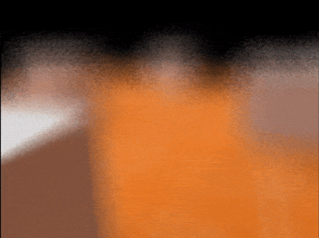

# Unity Screen Space Ray Traced Depth of Field

  

## Overview
This is just an exercise, more a proof of concept,  for a **screen space ray traced depth of field** system for Unity.
In its current state, it's far from being optimized, and it's barely realtime; for any number of samples per pixel greater than 4, the fps drop is substantial.

## Usage

  

- Add the SSRTDOF component to the main camera.
- Populate the Meshes list with all the meshes affected from the dof.
	> This list is needed in order to render the meshes into a linear depth buffer, in my todo list there is the task to make this automatic without the list, so it will be removed.
- Set the values for the **focal distance**, the **aperture** and the **marching steps**.

It is possible to modify the number of **samples per pixel** by changing the *#define SPP* in the file *SSRTDOF.shader*

## Further Developement
The next steps are aimed mainly to the optimization, the idea is to check the researches done in the field of **screen space reflections** (which is a more studied topic) and see if are applicable for this project.

## License
This project is licensed under the MIT License - see the [LICENSE]
